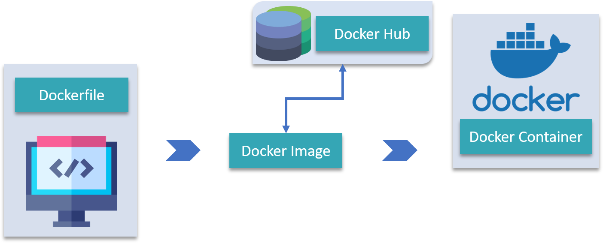
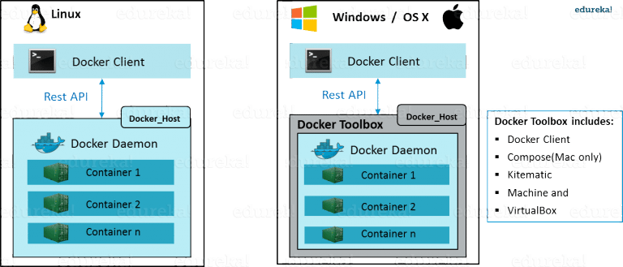

# ---------------------------  Docker Interview Questions ---------------------------

### What is virtualization?
#### <b>Answer</b>:-Virtualization refers to importing a guest operating system on the host operating system and allowing developers to run multiple OS on different VMs while all of them run on the same host, thereby eliminating the need to provide extra hardware resources.
In virtualization, each application and OS live in a separate software container called VM. Where VMs are completely isolated, all computing resources, such as CPUs, storage, and networking, are pooled together, and they are delivered dynamically to each VM by a software called hypervisor.  
<margin-left:100px /> 
However, running multiple VMs over the same host leads to degradation in performance. As guest OSs have their own kernel, libraries, and many dependencies running on a single host OS, it takes a large occupation of resources such as processor, hard disk, and, especially, RAM.

### What is containerization?
<b>Answer: </b>Containerization is a technique where virtualization is brought to the level of an OS. In containerization, we virtualize OS resources. It is more efficient as there is no guest OS consuming host resources. 
<margin-left:100px />  
Advantages of containerization-
- Containers are small and lightweight as they share the same OS kernel.
- They do not take much time, only seconds, to boot up.
- They exhibit high performance with low resource utilization.

### Containerization vs virtualization
In the case of containerization, all containers share the same host OS. Multiple containers get created for every type of application making them faster but without wasting the resources, unlike virtualization where a kernel is required for every OS and lots of resources from the host OS are utilized. | | OR Virtualization enables you to run multiple operating systems on the hardware of a single physical server, while containerization enables you to deploy multiple applications using the same operating system on a single virtual machine or server.  

## Let me summarize the learning till now:

- Virtual Machines are slow and take a lot of time to boot.
Containers are fast and boots quickly as it uses host operating system and shares the relevant libraries.
- Containers do not waste or block host resources unlike virtual machines.
- Containers have isolated libraries and binaries specific to the application they are running.
- Containers are handled by Containerization engine.
- Docker is one of the containerization platforms which can be used to create and run containers.

### What is Docker?

<b>Answer: </b>Docker is a containerization platform that packages your application and all its dependencies together in the form of a docker container to ensure that your application works seamlessly in any environment.

### What is Docker-Hub or Docker registry?
<b>Answer: </b>Docker Hub is a registry service on the cloud that allows you to download Docker images that are built by other communities. You can also upload your own Docker built images to Docker hub.

### what is Docker image?
<b>Answer: </b>In Docker, everything is based on Images. An image is a combination of a file system and parameters. | | Docker Image can be compared to a template which is used to create Docker Containers. They are the building blocks of a Docker Container. These Docker Images are created using the build command.  
Docker lets people (or companies) create and share software through Docker images. Also, you don’t have to worry about whether your computer can run the software in a Docker image — a Docker container can always run it.

### what is Docker - Containers?
<b>Answer: </b>Containers are instances of Docker images that can be run using the Docker run command. The basic purpose of Docker is to run containers.

### what is DockerFile?
<b>Answer: </b>A Dockerfile is a text document which contains all the commands that a user can call on the command line to assemble an image. So, Docker can build images automatically by reading the instructions from a Dockerfile. You can use docker build to create an automated build to execute several command-line instructions in succession.

### what is Docker Compose?
<b>Answer: </b>Docker Compose is a YAML(yet another markup language) file which contains details about the services, networks, and volumes for setting up the application. So, you can use Docker Compose to create separate containers, host them and get them to communicate with each other. Each container will expose a port for communicating with other containers. | | Docker Compose is basically used to run multiple Docker Containers as a single server

### What is Docker Engine ?
<b>Answer: </b>Docker Engine is simply the application that is installed on your host machine. It works like a client-server application which uses:

- A server which is a type of long-running program called a daemon process
- A command line interface (CLI) client
- REST API is used for communication between the CLI client and Docker Daemon

### What is Docker Architecture?
<b>Answer: </b> [Docker Architecture](https://www.edureka.co/blog/docker-architecture/) includes a Docker client – used to trigger Docker commands, a Docker Host – running the Docker Daemon and a Docker Registry – storing Docker Images. The Docker Daemon running within Docker Host is responsible for the images and containers.

- To build a Docker Image, we can use the CLI (client) to issue a build command to the Docker Daemon (running on Docker_Host). The Daemon will then build an image based on our inputs and save it in the Registry, which can be either Docker hub or a local repository
- If we do not want to create an image, then we can just pull an image from the Docker hub, which would have been built by a different user
- Finally, if we have to create a running instance of my Docker image, we can issue a run command from the CLI, which will create a Container.
