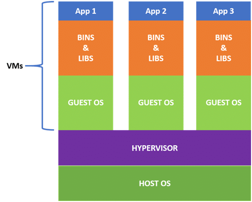

# ---------------------------  Docker Interview Questions ---------------------------

### 1.What is virtualization?
#### <b>Answer</b>:-Virtualization refers to importing a guest operating system on the host operating system and allowing developers to run multiple OS on different VMs while all of them run on the same host, thereby eliminating the need to provide extra hardware resources.
In virtualization, each application and OS live in a separate software container called VM. Where VMs are completely isolated, all computing resources, such as CPUs, storage, and networking, are pooled together, and they are delivered dynamically to each VM by a software called hypervisor.  
<margin-left:100px /> 
However, running multiple VMs over the same host leads to degradation in performance. As guest OSs have their own kernel, libraries, and many dependencies running on a single host OS, it takes a large occupation of resources such as processor, hard disk, and, especially, RAM.

### 2.What is containerization?
<b>Answer: </b>Containerization is a technique where virtualization is brought to the level of an OS. In containerization, we virtualize OS resources. It is more efficient as there is no guest OS consuming host resources. 
<margin-left:100px />  
Advantages of containerization-
- Containers are small and lightweight as they share the same OS kernel.
- They do not take much time, only seconds, to boot up.
- They exhibit high performance with low resource utilization.

